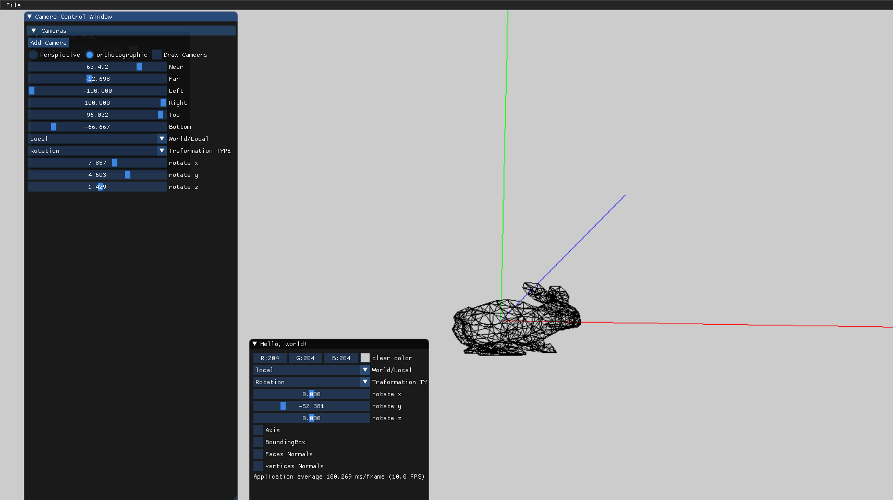
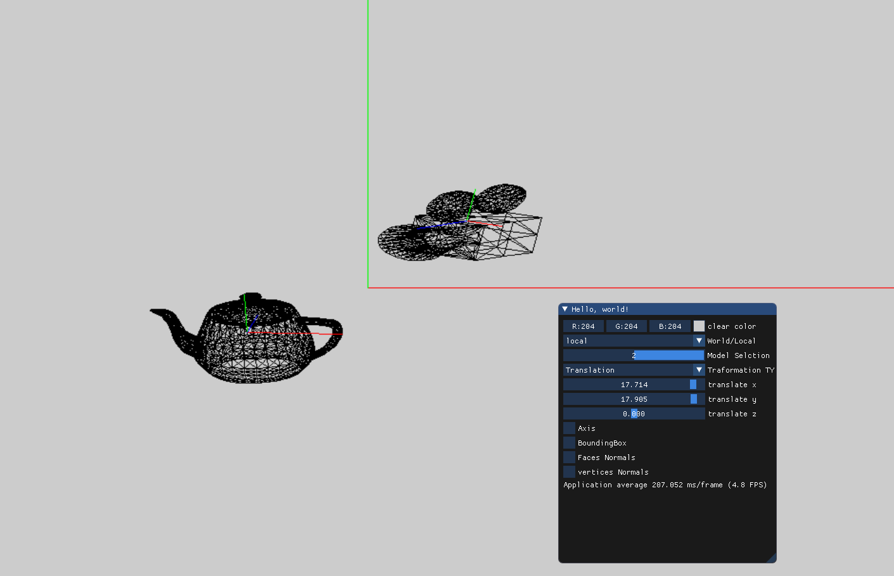
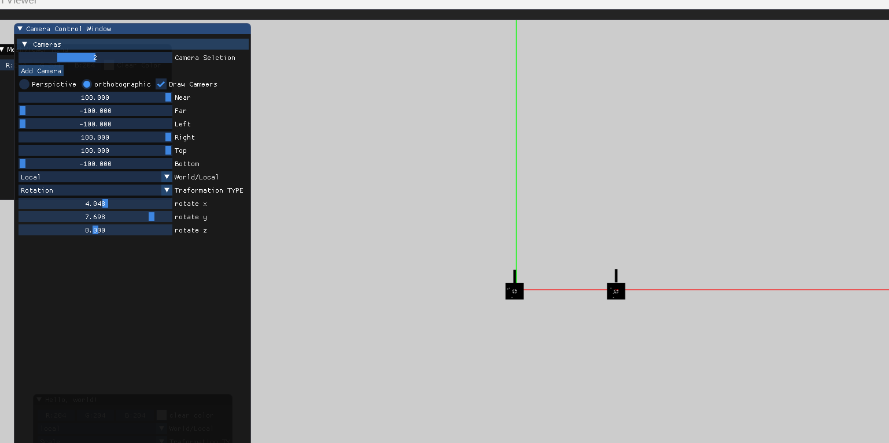

=== Assignment1 part c ===

1) we define  a function called "Point adjustment" which imply an adjustment on the mesh model points to 
take place in the center of the window. the idea of the function:
    if (viewport_width_ > viewport_height_)
	{
		x = x * (viewport_height_ / constant1) + (viewport_width_ *constant2);
		y = y * (viewport_height_ / constant3) + (viewport_height_ * constant4);
	}
	else
	{
		x = x * (viewport_width_ / constant2) + (viewport_width_ * constant1);
		y = y * (viewport_width_ / constant4) + (viewport_height_ * constant3);
	}

more clear videos on the orthological projection :
	- orthoProjection_model
	
https://user-images.githubusercontent.com/82311533/209285269-9f084786-3b5e-47aa-9252-2bb50a01de5d.mp4

	- orthoProjection_addCamera
	

https://user-images.githubusercontent.com/82311533/209285343-0cbc2ed6-f814-413b-bf34-d802db33f41b.mp4

	
	- local_operations/features
	

https://user-images.githubusercontent.com/82311533/209285404-0577bbdb-324a-4cdf-a37d-062e38458153.mp4

https://user-images.githubusercontent.com/82311533/209285441-bf6c96d2-a5a8-4295-a242-4f6eca8229cf.mp4

	- orthological_pic
	
	

2) Camera class is inherited from model class, so that it has "translation_matrix" which been affected by the vector
	of the translation => (translate_x,translate_y,translate_z), once the user press on "L" letter the translate_x value been 
	incremented by negative value. and if we press "R" its incremented by positive value.

3) not supported yet in our project 
4) as shown in the video "Features" and image "show_local_world_axis"
	
	

https://user-images.githubusercontent.com/82311533/209285712-529a9747-94d0-416d-acc2-5a779911190d.mp4

5) shown in video "localoperations"

https://user-images.githubusercontent.com/82311533/209285727-d4ec1bac-6b87-46b3-bddb-47efc3db8b56.mp4

6) the idea is to go over the verticies and calculate the global minimum and the global maximum value so we get 8 points/vetritcies
    (taking in count the transformation of the model) for the bounding box, then we use drawline function to draw line between the verticies.
    shown in image "boundingBox" and in video "Features"

	
	

https://user-images.githubusercontent.com/82311533/209285803-e9e5a280-821c-4a84-af63-c4452a36cfb6.mp4

7)for each Face we calculated the "normal" using the normula we learned then we scaled the normal up to see it at the on the screen, then we calculated the center of the face to Draw a line from there, this is the normal direction

shown in images:
	- facenormals
	- vertexnormals
	- video "Features"

https://user-images.githubusercontent.com/82311533/209285836-3818cf47-2dd1-4a7d-9d7c-cfc5a8be676e.mp4

8) we can compare with the videos :"orthoProjection_model" and "PerspectiveProjection"
    the diffrence is that the perspective is more realistic
    
orthoProjection_model:

https://user-images.githubusercontent.com/82311533/209285880-8ac7d1cf-a655-46ad-a49d-3741d5ca5509.mp4

PerspectiveProjection:

https://user-images.githubusercontent.com/82311533/209285944-73a01f3a-52b3-4fc9-88ab-9b912fee8a87.mp4

9 - 11) not implemented

12) shown in image "twoCameras" 

