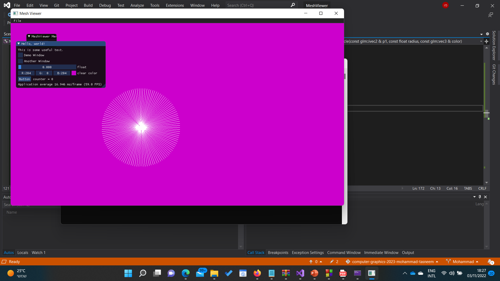
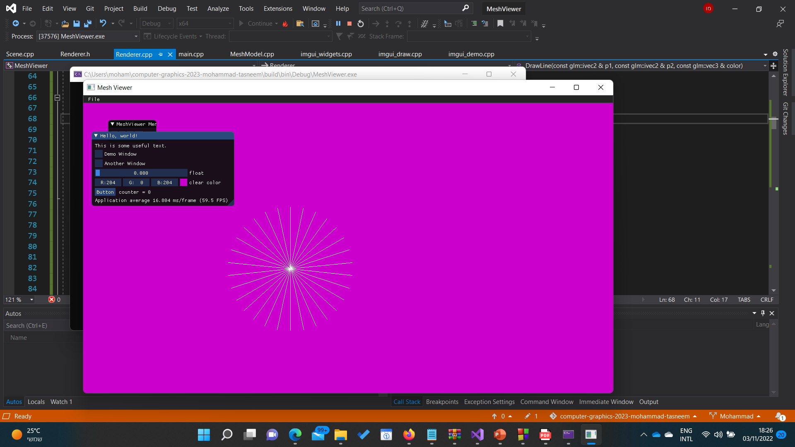
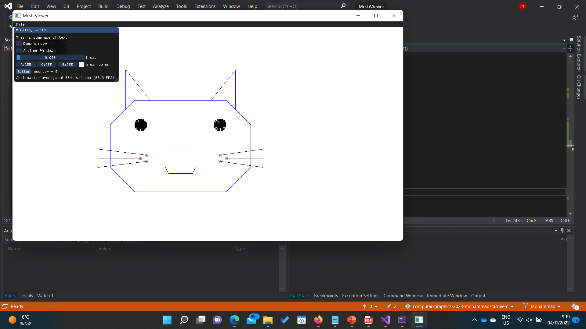

===============	IMPLEMENTATION OF THE ALGORITHM  ===============

void Renderer::DrawLine(const glm::ivec2& p1, const glm::ivec2& p2, const glm::vec3& color)
{
	// TODO: Implement bresenham algorithm
	// https://en.wikipedia.org/wiki/Bresenham%27s_line_algorithm

	// endpoints coordinates 
	int x1 = p1.x, y1 = p1.y, x2 = p2.x, y2 = p2.y;

	bool switch_roles = false, reflect = false;
	
	// the first four cases are trivial and doesn't require bresenham algorithm
	// s.t it is when the slip is 0, infinity, 1 and -1

	// vertical line case - inf slop
	if (x1 == x2) {
		while (y1 != y2) {
			PutPixel(x1, y1, color);
			y1 = (y1 > y2) ? y1 - 1 : y1 + 1; // adjust y1 accordingly to reach y2
		}
		return;
	}

	// horizontal line case - zero slop
	if (y1 == y2) {
		while (x1 != x2) {
			PutPixel(x1, y1, color);
			x1 = (x1 > x2) ? x1 - 1 : x1 + 1; // adjust x1 accordingly to reach x2
		}
		return;
	}

	// determine which endpoint to use as a starting position
	if (x1 > x2) {
		int tmp = x1;
		x1 = x2;
		x2 = tmp;

		//swapping the second coordinate of the point accordingly 
		tmp = y1;
		y1 = y2;
		y2 = tmp;
	}

	float dy = y2 - y1;
	float dx = x2 - x1;
	//slop
	float slop = dy / dx;
	//error
	int e = -dx;

	// slop is 1 or -1
	if (slop == 1 || slop == -1) {
		while (x1 <= x2) {
			PutPixel(x1, y1, color);
			x1 = x1 + 1 * slop;
			y1 = y1 + 1 * slop;
		}
	}

	// calculating bresenham algorithm for every octan

	if (slop > 1) {
		switch_roles = true;
		e = -dy;

	}

	if (slop<0 && slop>-1) {
		reflect = true;
		e = -dx;
	}

	if (slop < -1) {
		reflect = true;
		switch_roles = true;
		e = -dy;
	}

	int x = x1, y = y1;

	if (switch_roles) {
		//cases where slop>1 or slop<-1
		while ((y <= y2 && !reflect) || (reflect && y >= y2)) {
			if (e > 0) {
				if (reflect) { // slop<-1
					x = x + 1;
					e = e + 2 * dy;
				}
				else {	// slop>1
					x = x + 1;
					e = e - 2 * dy;
				}
			}
			PutPixel(x, y, color);
			if (reflect) {	// slop<-1
				y = y - 1;
				e = e + 2 * dx;
			}
			else {	// slop>1
				y = y + 1;
				e = e + 2 * dx;
			}
		}
	}
	else {
		//cases where 0<slop<1 or -1<slop<0
		while (x <= x2) {
			if (e > 0) {
				if (reflect) {	//-1<slop<0
					y = y - 1;
					e = e - 2 * dx;
				}
				else {	//0<slop<1
					y = y + 1;
					e = e - 2 * dx;
				}
			}
			PutPixel(x, y, color);
			if (reflect) {	//-1<slop<0
				x = x + 1;
				e = e - 2 * dy;
			}
			else {	//0<slop<1
				x = x + 1;
				e = e + 2 * dy;
			}

		}

	}
	
}

void Renderer::Drawcircle(const glm::ivec2& p1, const float radius, const glm::vec3& color)
{
	int x1 = p1.x;
	int y1 = p1.y;
	int a = 120;	// step size
	for (int i = 0; i < a; i++)
	{
		int x2 = int(x1 + radius * sin(2 * M_PI * i / a));
		int y2 = int(y1 + radius * cos(2 * M_PI * i / a));
		glm::vec2 p2 = glm::vec2(x2, y2);
		DrawLine(p1, p2, color);
	}
	return;
}

===============	PICTURES SANITY CHECK  ===============	

 - first run with a=60
  
  
 - second run with a=120
 

===============	DRAWING OF OUR CHOICE  ===============	

 