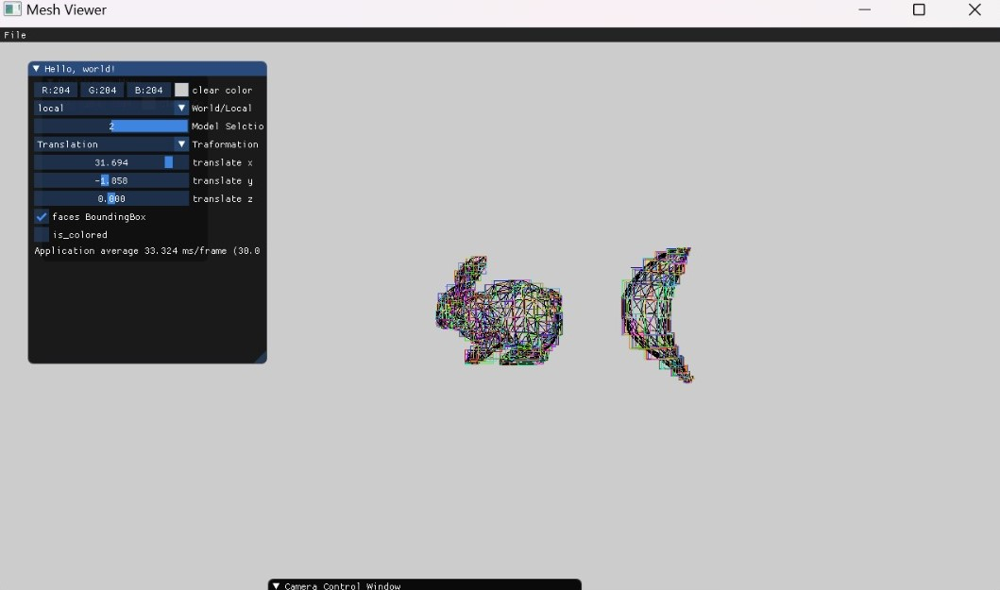
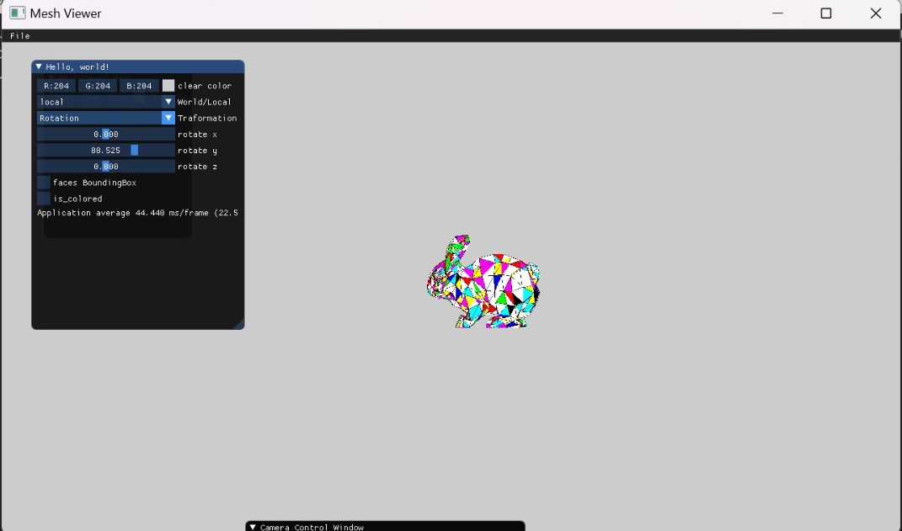
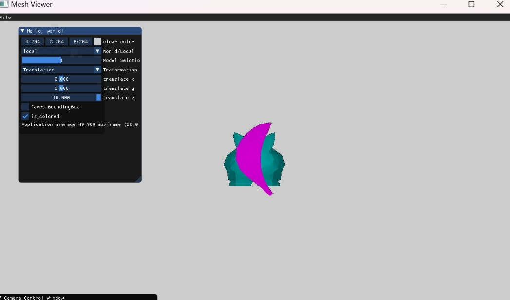
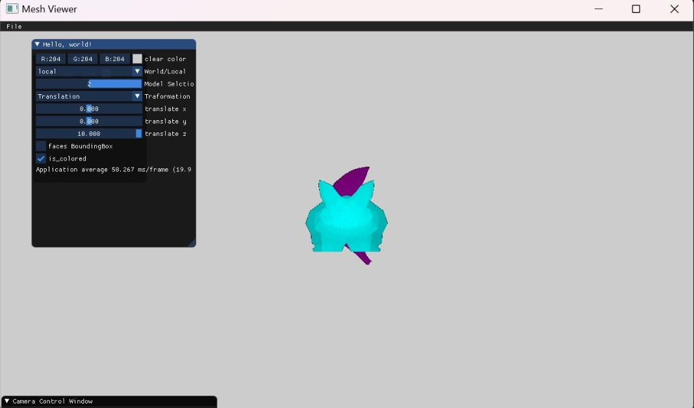
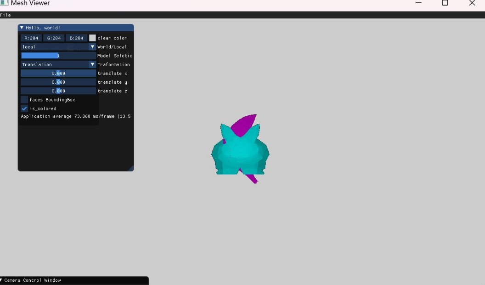
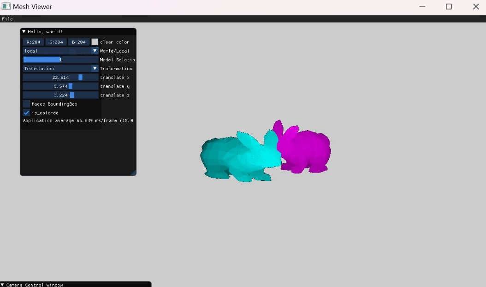

# Assignement 2_part a
 

 1.Drawing the bounding rectangle for each triangle
    we keep two fields (for each axis x and y) called min_x/max_x(same in y : min_y/max_y) as we have done before to draw the bounding box
    and draw line between them to draw the bounding box with appropriate color.
    
    
    
    

3.Changing the DrawTriangle function such that fills the entire triangle.
    

4.Implement the z-buffer algorithm
    in pictures which are attached below we can see that the objects looks more obvios (white light) in the close side 
    and more dark (black) in the far one.
    shown in images:

 

https://user-images.githubusercontent.com/82311533/211170377-a9efb7f6-188f-436c-962a-5e38fce8be00.mp4

https://user-images.githubusercontent.com/82311533/211170378-13db0c8d-e11f-4ce9-b856-b22e74e17a2c.mp4

