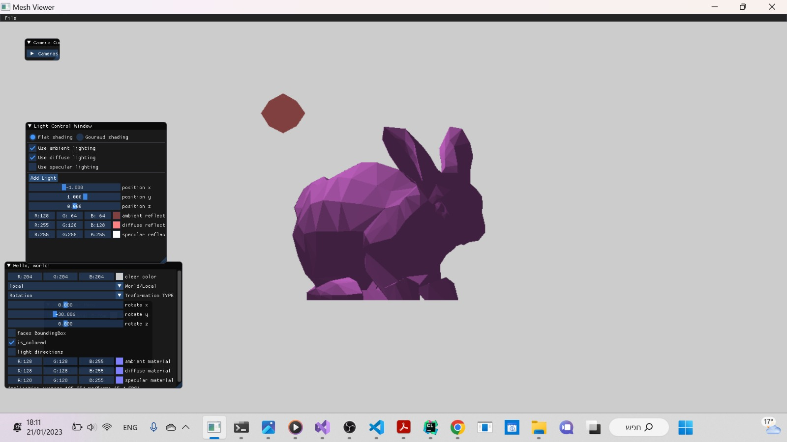
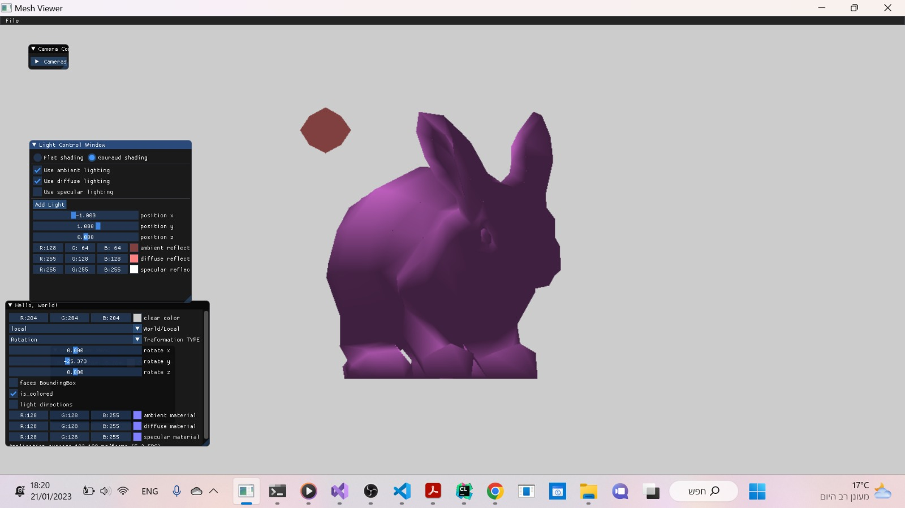
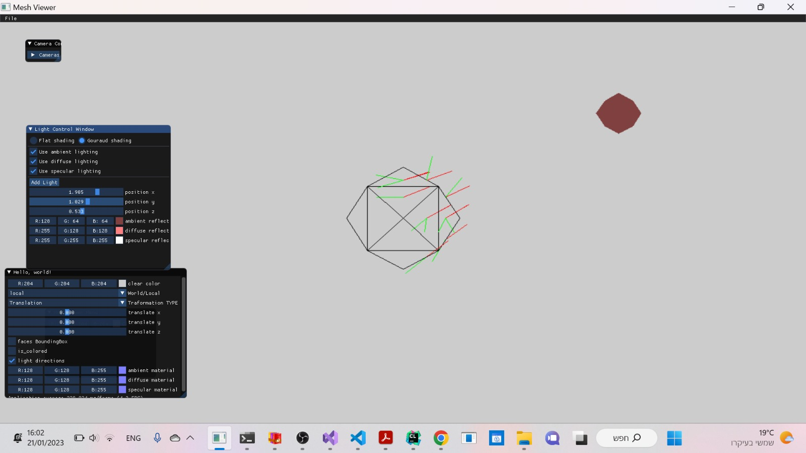
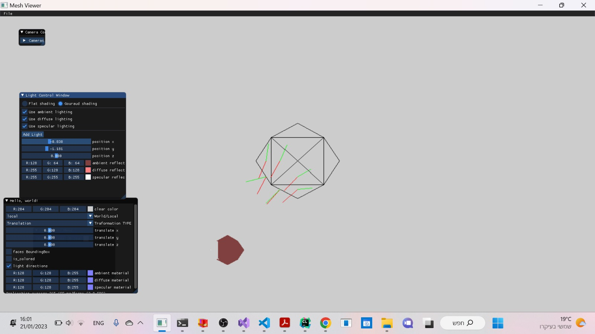
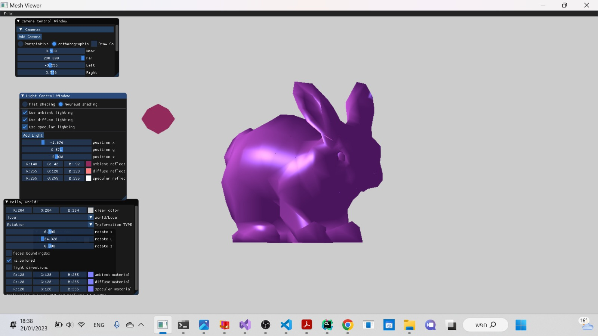
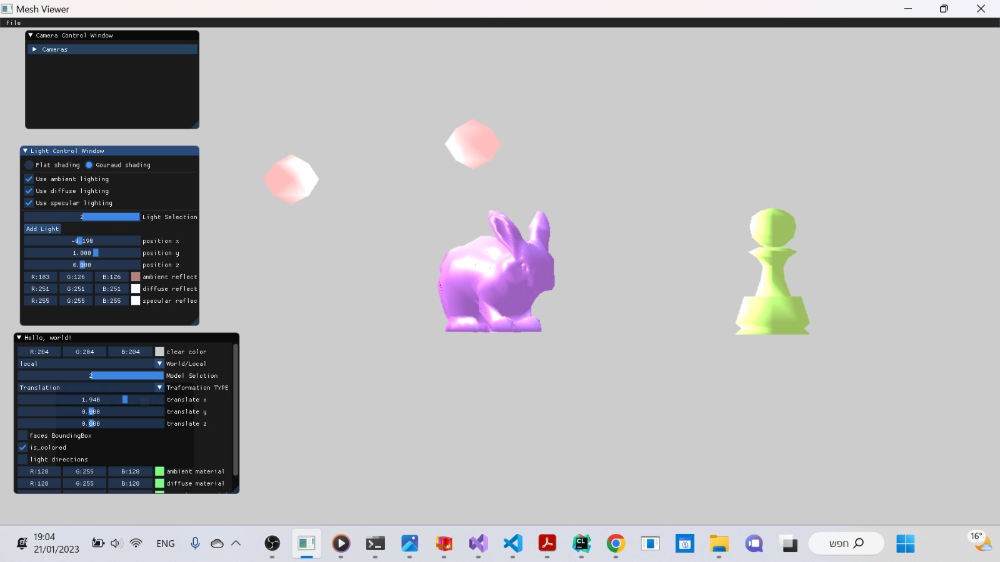

# Assignement 2_part 2

___
## 1.Ambient Light.
we used the formula that calculate ambient light: (Ia=Ka*La)
as shown in the video that is attached, no matter where the light is located, the color does not change (this is the definition of ambient light)
the color of the model was kind of blue : color(0.5f, 0.5f, 1.0f)
and the color of the ambient light was (by default): color(1.0f, 0.5f, 0.5f)
the light ambient is multiplied by the material ambient color so got the results:

shown in video : (ambient_light)

___
## 2.FlatShading + Diffuse
we calculated the difuuse light according to the formula we in lecture  : Id=Kd*(l.dot(n))*Ld
and then we imply flat shading on the scene
shown in image "diffuse"

___
## 3.Gouraud Shading
firstly we calculates the color for each vertex. and then for face i: for each pixel inside calculate by iterpolation 
its visible that guard is more smooth than flat shading (which decides one color per face)
shown in video "guard_shading"

___
## 4.Reflected Rays.
shown in images "Reflection1" + "Reflection2"

___
## 5.PhongShading with specular light
the light specular color is multiplied by the material specular color and by dot production between reflected light direction and camera direction.
and the phong shading is acheived by interpolating normals over each face in the model (this was implemented by a specific function called "scan" that calculates interpolation  for normals in each face )
shown in image: "phong _shading"

___
## 6. Show diffrent models and lighs
in addition to the previous pictures here attached additional video and image for multi models and multi lights
video : multi_models
image : multi _lights
