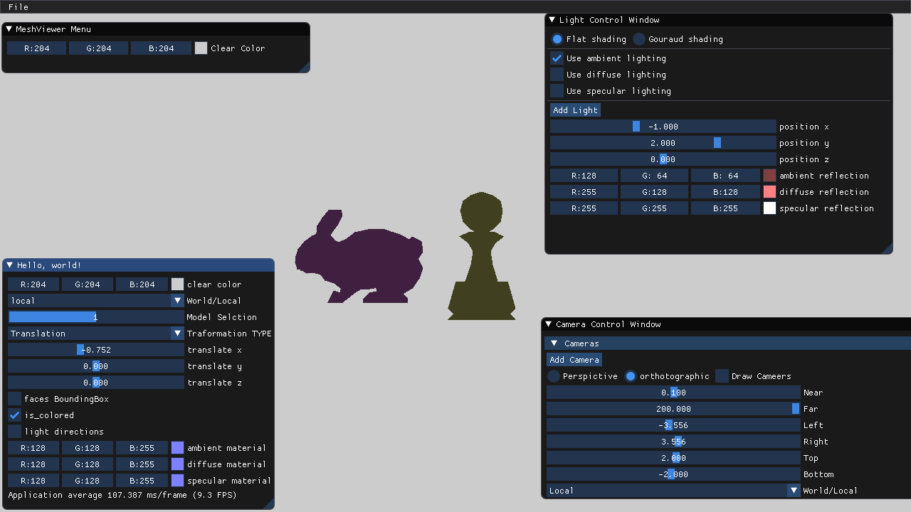
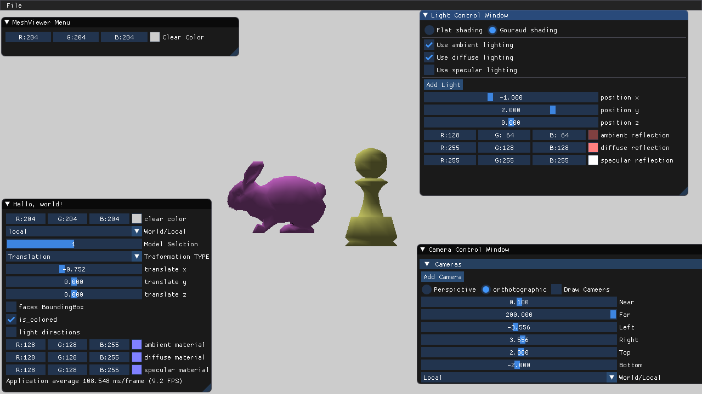
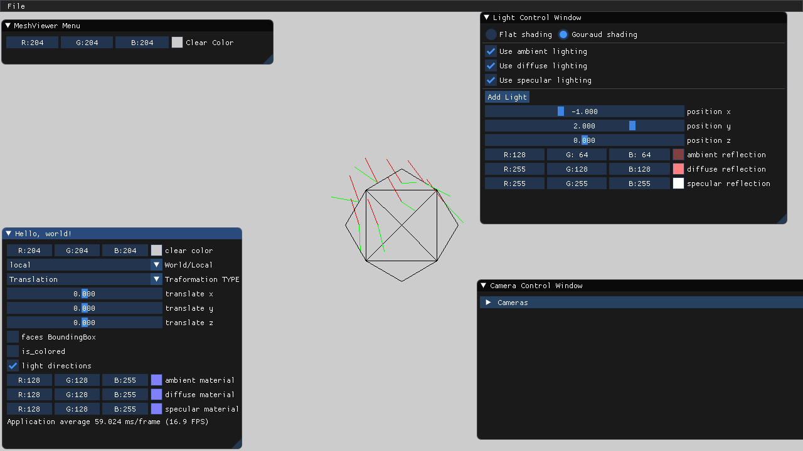
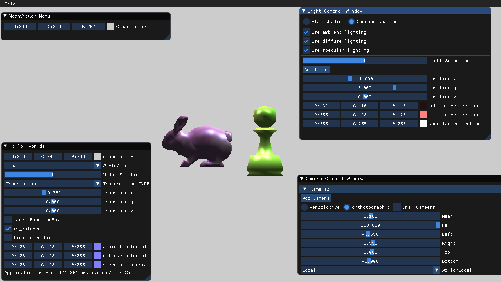

Task 1.
Ambient lighting is implemented in Renderer::ComputeAmbientLighting().
The light ambient color is multiplied by the material ambient color.
Therefore, the results are mixed.
- blue bunny under red light looks purple.
- green pawn  under red light looks yellow.

  
 
Task 2.
Diffuse lighting is implemented in Renderer::ComputeDiffuseLighting().
The light diffuse color is multiplied by the material diffuse color
and by the dot product between light direction and normal.
For flat shading, a single shaded color is used for the entire face,
resulting in a faceted appearance.

 
Task 3.
For Gouraud shading, each vertex has its own shaded color.
The colors are then interpolated over the face,
resulting in a smooth appearance.

 
Task 4.
Light directions and reflected light directions are shown as red and green lines.
This is implemented in Renderer::DrawMesh().
this image shows this with a simple model to avoid overcrowding.

 
Task 5.
Specular lighting is implemented in Renderer::ComputeSpecularLighting().
The light specular color is multiplied by the material specular color
and by the dot product between reflected light direction and camera direction.
The dot product is raised to a high power for narrower highlights.
Phong shading is achieved by interpolating positions and normals
over the face in Renderer::Scan().

 
Task 6.
An example of two lights is shown in the image below.
Ambient light colors are reduced here to avoid too bright lighting.
Note that Scene::AddModel() and Scene::AddLight() set default properties
for new models and lights to reasonable values
